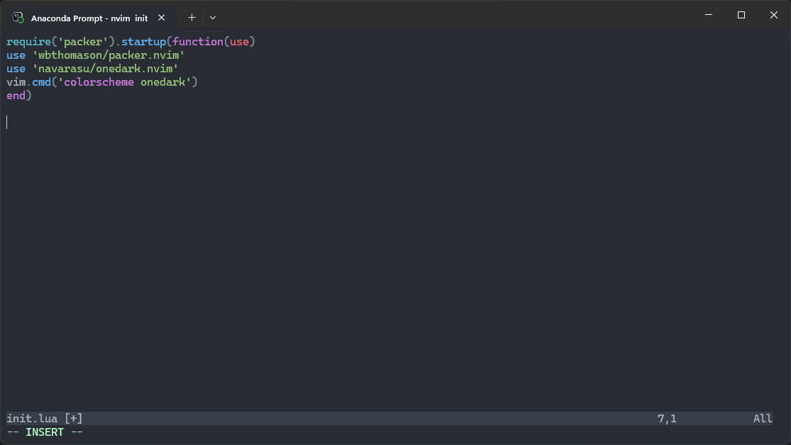
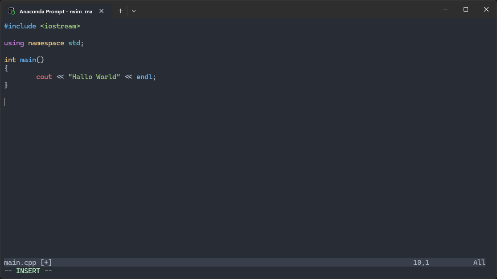

`git clone --depth 1 https://github.com/JanDalhuysen/my-neovim-configuration.git C:/users/USERNAME/AppData/Local/nvim`

`git clone --depth 1 https://github.com/wbthomason/packer.nvim C:/users/USERNAME/AppData/Local/nvim-data/site/pack/packer/start/packer.nvim`

`git clone --depth 1 https://github.com/bfrg/vim-c-cpp-modern C:/users/USERNAME/AppData/Local/nvim-data/site/pack/vim-cpp-modern/start/vim-cpp-modern`

`git clone --depth 1 https://github.com/github/copilot.vim.git C:/users/USERNAME/AppData/Local/nvim-data/site/pack/github/start/copilot.vim`

